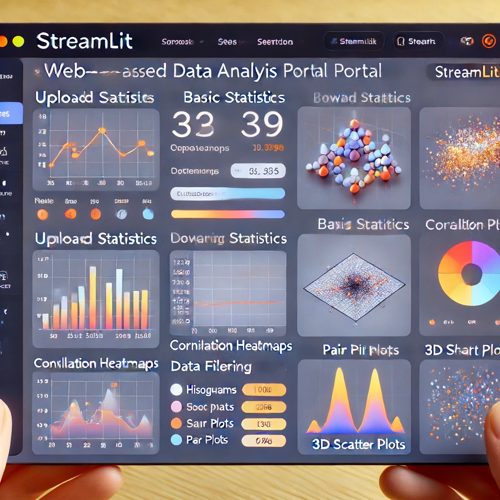

# Data Analysis Portal

This project is a web-based data analysis portal built using Streamlit. It allows users to upload datasets, view basic statistics, filter data, and visualize data using various charts.

## Features

1. **Upload Datasets**: Users can upload datasets in Excel or CSV format.
2. **Basic Statistics**: Display basic statistics such as mean, median, standard deviation, etc.
3. **Correlation Heatmap**: Visualize correlations between different numeric columns.
4. **Data Filtering**: Filter data based on user-selected criteria.
5. **Data Visualization**:
   - Histogram and density plots.
   - Box plots.
   - Scatter plots with regression lines.
   - Pair plots.
   - 3D scatter plots (Useful for visualizing relationships between three variables).
   - Bar charts for categorical data.

## Important Note

Before uploading your dataset, please ensure that it has undergone necessary data cleaning and preprocessing steps. This includes handling missing values, removing duplicates, and ensuring that data types are correctly formatted. Clean and well-preprocessed data will lead to more accurate and meaningful analysis results.


## Installation

### Prerequisites

- Python 3.7 or higher

### Steps

1. Clone the repository:
    ```bash
    git clone https://github.com/yourusername/your-repo-name.git
    cd your-repo-name
    ```

2. Install the required packages:
    ```bash
    pip install -r requirements.txt
    ```

3. Run the Streamlit application:
    ```bash
    streamlit run app.py
    ```

## Usage

1. **Upload a Dataset**: Click on the "Browse files" button to upload an Excel or CSV file.
2. **View Basic Statistics**: Check the box to display basic statistics.
3. **Show Correlation Heatmap**: Check the box to visualize correlations.
4. **Filter Data**: Use the filtering options to refine the dataset.
5. **Data Visualization**:
   - **Histogram and Density Plots**: Select a numeric column to visualize its distribution.
   - **Box Plots**: Select a numeric column to visualize its distribution and identify outliers.
   - **Scatter Plots with Regression Lines**: Select two numeric columns to visualize their relationship.
   - **Pair Plots**: Select multiple numeric columns to visualize relationships between them.
   - **3D Scatter Plots**: Select three numeric columns to visualize relationships between them in 3D.
   - **Bar Charts for Categorical Data**: Select a categorical column to visualize the distribution of 
       categories.


## Example



## License

This project is licensed under the MIT License. See the [LICENSE](LICENSE) file for details.

## Contributing

1. Fork the repository.
2. Create a new branch (`git checkout -b feature-branch`).
3. Commit your changes (`git commit -m 'Add some feature'`).
4. Push to the branch (`git push origin feature-branch`).
5. Open a pull request.

## Contact

If you have any questions or suggestions, feel free to open an issue or contact me at [narendra.insights@gmail.com](mailto:narendra.insights@gmail.com).
